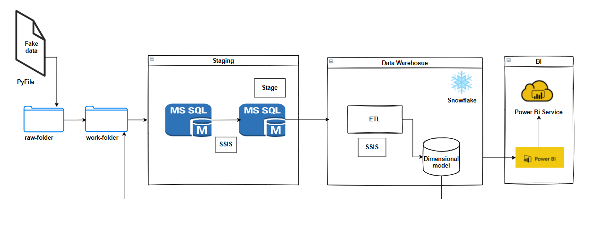
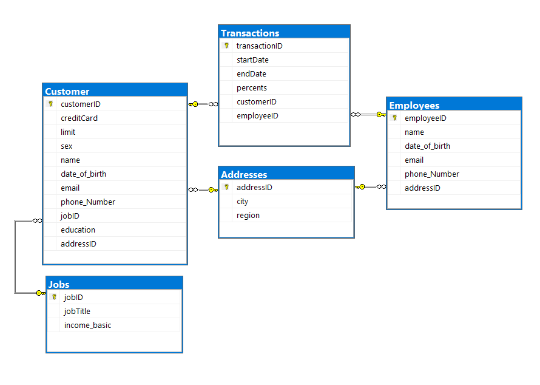
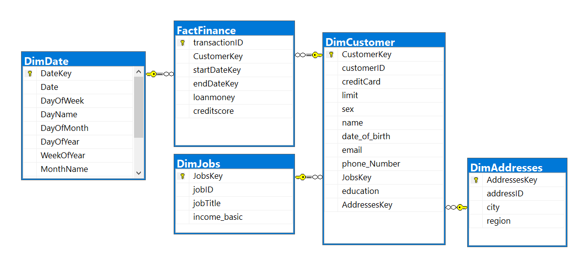
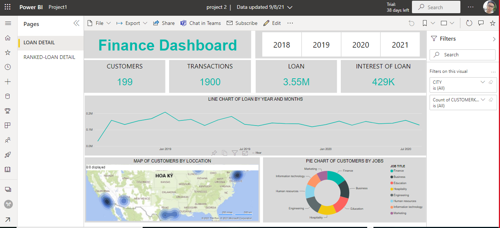

## FIRST PROJECT FA (FINANCE PROJECT)

## I. Decsription of this project

**Define the business needs:** 
Finance- We is trying to evaluate the a *consumer's creditworthiness* (based on historical financial and personal information)
**Solution:**
*We will need to aggregate data based on *transition*, *customer*, *jobs*, *addresses* and *date*. It will be evaluated based on *credit score* (historical financial and personal information)*

## II. Working data

Data is generated based on Python script. The database (.csv flat files) will include:
1. Address.csv
	This file includes basics data for an address such as addressID, city, region.
2. Job.csv
	This file includes basics data for a job such as jobID, jobTitle, income_basic.
3. Customer.csv
	This file includes basics data for a job such as customerID, creditCard, limit, sex, firstname, lastname, date_of_birth, email, phone_Number, jobID, education, addressID.
4. Employee.csv
	This file includes basics data for an employee such as employeeID, name, date_of_birth, email, phone_Number, addressID.
5. Transaction.csv
	This file includes basics data for an transaction such as transactionID, startDate, endDate, percents, customerID, employeeID.
### Flow [flow.PNG](./docs/flow.PNG)
## III. Detail of work

1. Generate Data
    - Generate rawdata and copy to workfolder
2. Design data pipeline 
3. Design finance database 
4. Design the dimensional model schema 
    - Defined Dimensiona tables and Facts tables
    - Design logical data map: [here]()
5. Ingest data from flat file csv
    -  Design SSIS package to ETL the data
    -  Using SSIS pipe line load data to SQL Server (Finance Database)
    -  Using SSIS stage data in SQL Server (stage)
    -  Using SQL create, run job and schedule Run SSIS.
    -  Set log, error handle for SSIS pakage. 
6. Upload and download data on Snowflake
    -  Using SSIS: upload data and dimDate and update data (auto generated) from SQL Server to Snowflake using ODBC.
    -  Using Snowpipe: Python API put file to external stage, then create a pipeline to upload data fact continuously to Snowflake stage (Python_API_Stage).
    -  Using Task and Schedule to update data from NDS to Datawarehouse.
    -  Set account for Partner and trainner.
    -  Using python API to download dim fact tables in warehouse schema to local machine.
7. Visualize data using PowerBI
   -   Connect Snowflake source.
   -   Visualize data.
   -   Connect Power BI Desktop with Power BI Service
   -   Set schedule fresher data source.

## IV. Set up
1. Go to each folder. Install Module neccesary to run python by run PowerShell. In Folder (.\resources\rawData\Object): 
   Make data Fake, In Folder (.src\snowpipe) upload and download data from snowpipe.
   ```bash  
   pip install -r requirements.txt 
   ```

2. Download and install ODBC Driver [here](https://sfc-repo.snowflakecomputing.com/odbc/win64/latest/index.html)

3. Set OBDC with DNS 32bit/64bit with information:

   

4. Run [main.py](.\resources\rawData\Object) to create fake data.
   ```bash  
   python main.py
   ```

5. Open [finance.sln](./resources/Solution-SSIS/finance.sln). In `Solution Explore`, right click on `Finance` and choice `Deploy`. 
   Next when you see `Select Destination`,fill your SQL servername in the box, hit `browse` and create `Project 2` path if not exit.

6. Login into MSSQL, change some variable necessary and run [init_SQL.sql](./src/mssql/init_SQL.sql). 
7. Run [Snowpipe.sql](./src/snowflake/Snowpipe.sql),[init_snowflake.sql](./src/snowflake/init_snowflake.sql), [task_procedure.sql](./src/snowflake/task_procedure.sql) in https://lf68175.central-us.azure.snowflakecomputing.com/console with acc: NhatLQ3, passcode:Nhat123456
8. Execute package finance.dtsx and start job in SQL server.
9. We create [snowpipe.py](./src/snowpipe/snowpipe.py) to upload fact finance to snowflake and download data warehouse to local. Run:
   ```bash  
   python snowpipe.py
   ```
10. PowerBI [project 2.pbix](.powerBI/project 2.pbix) to watch visualization data WH we build 

## V. Dashboard
1. Overview : [here](https://app.powerbi.com/view?r=eyJrIjoiMThmNjQ5N2MtZDYyMy00YzE2LThlNjctOWMzNGEzMGY3ZjAzIiwidCI6ImYwMWU5MzBhLWI1MmUtNDJiMS1iNzBmLWE4ODgyYjVkMDQzYiIsImMiOjEwfQ%3D%3D&pageName=ReportSectionfd6c4f8a7b4196007673)

2. Rankofloan: [here](https://app.powerbi.com/view?r=eyJrIjoiMThmNjQ5N2MtZDYyMy00YzE2LThlNjctOWMzNGEzMGY3ZjAzIiwidCI6ImYwMWU5MzBhLWI1MmUtNDJiMS1iNzBmLWE4ODgyYjVkMDQzYiIsImMiOjEwfQ%3D%3D&pageName=ReportSectionfd6c4f8a7b4196007673)


### Note account trainer (snowflake):
1. Account: longbv1, pass:123456
2. Account: mainq2, pass:123456
